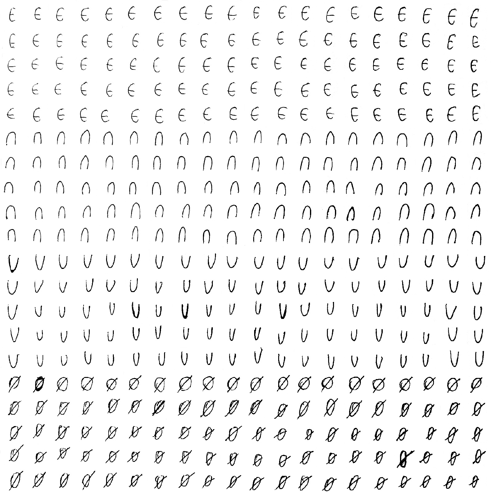
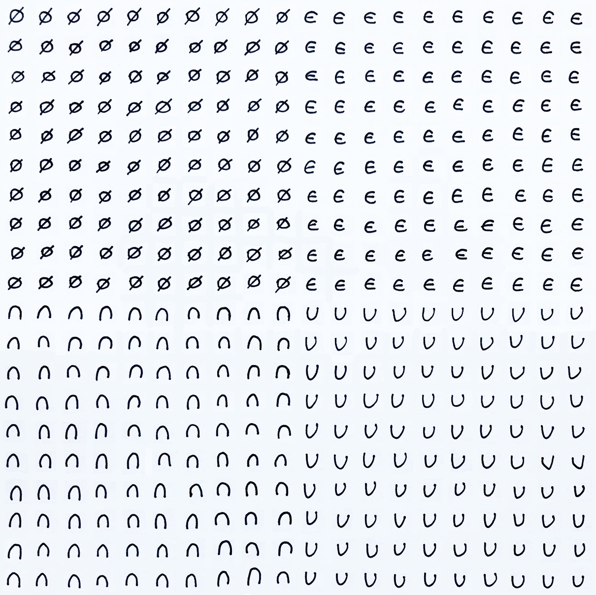
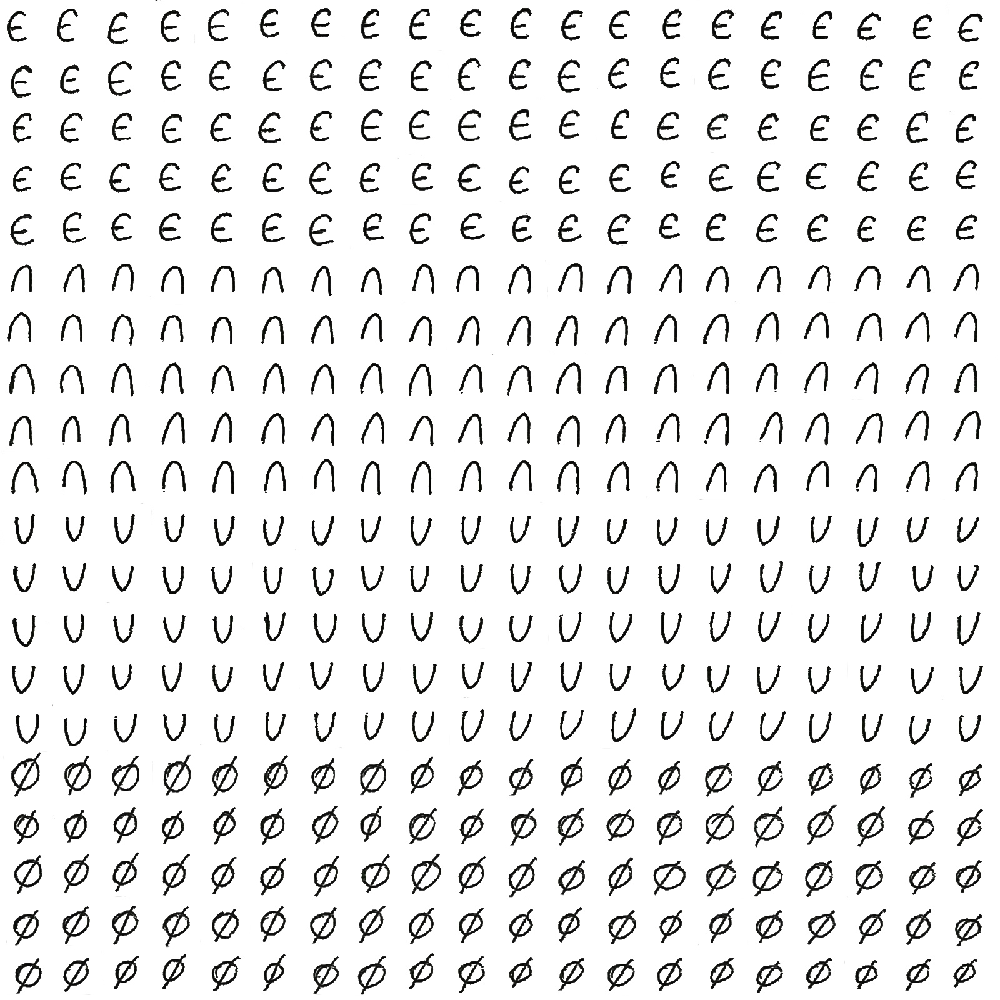

# Отчет по лабораторной работе 
## по курсу "Искусственый интеллект"

## Нейросетям для распознавания изображений


### Студенты: 

| ФИО       | Роль в проекте                     | Оценка       |
|-----------|------------------------------------|--------------|
| Бабичева Анна Дмитриевна | Обработала датасет, обучила светрочную модель  |          |
| Подгорная Виолетта Михайловна | Обработала фотографии с символами, обучила полносвязную однослойную молель, написала отчет |       |
| Скуридин Алексей Анатольевич | Обучил полносвязную многослойную модель |      |

## Результат проверки

| Преподаватель     | Дата         |  Оценка       |
|-------------------|--------------|---------------|
| Сошников Д.В. |   27.05.2020           |     4.8          |

> *Было бы полезно проанализировать наличие переобучения или недообучения по графикам точности.*

## Тема работы

Опишите тему работы, включая предназначенный для распознавания набор символов.

> *Варианты рукописных символов (номер определяется следующим образом: ASCII-коды первых символов фамилий всех участников команды складываются и берется остаток от деления на 5 + 1)*

Бабичева -> B -> 42

Подгорная -> P -> 50

Скуридин -> S -> 53

( 42 + 50 + 53 ) % 5 + 1 = 0 + 1 = 1

Следовательно, вариант 1: символы принадлежности множеству, пересечения множества, объединения множества и символ пустого множества.

Символ принадлежности множеству: ∈

Символ пересечения множества: ⋂

Символ объединения множества: ⋃

Символ пустого множества: ∅

## Распределение работы в команде

| ФИ       | Чем занимался                     |
|-----------|------------------------------------|
| Бабичева Анна | Вырезала изображения, обучила светрочную модель  |
| Подгорная Виолетта | Обработала фотографии с символами, обучила полносвязную однослойную молель |
| Скуридин Алексей | Обучил полносвязную многослойную модель |

## Подготовка данных

> Приведите фотографии исходных листков с рукописными символами:

[символы для обучающего набора:](https://github.com/MAILabs-Edu-AI/lab-neural-networks-vision-neww_teamm/blob/master/train_1.jpg)



[символы для обучающего набора:](https://github.com/MAILabs-Edu-AI/lab-neural-networks-vision-neww_teamm/blob/master/train_2.jpg)



[символы для тестировочного набора:](https://github.com/MAILabs-Edu-AI/lab-neural-networks-vision-neww_teamm/blob/master/test.jpg)



> Как осуществлялась подготовка датасета? С какими сложностями пришлось столкнуться? Фрагменты кода для разрезания картинки на части...

Для одинаковости фотографий сиволов было решено использовать шаблон листа в клеточку, найденный на просторах интернета. Были выписаны 1200 символов, по 400 каждый. Затем листы с символами были сфотографированы и обработаны при помощи ПО *Adobe Photoshop* (фотографии были сделаны в разном освещении, поэтому были обработаны "с эффектом отсканированной фотографии" - белый фон, темные буквы).
Отредактированные фотографии были обрезаны максимально близко к клеткам для того, чтобы было удобнее вырезать отдельные символы. Так же пришлось сжимать и обрезать фотографии под один размер. Учитывая, что у всех членов команды были использованы разные ручки для написания символов (получились 3 фотографии: две с относительно жирными символами, одна - с тонкими символами), было решено разбить 2 фотографии (с жирными и тонкими символами) на символы обучающей выборки, а оставшуюся фотографию с относительно жирными символами - на символы тестировочной выборки (чтобы сеть после обучения смогла обработать и жирные, и тонкие символы).

Однако уже на первых тестах было обнаружено, что наличие жирных и темных как сами символы клеток сильно ухудшает качество сети (так как при вырезании символов, например, из середины фотографии, получалось, что большую часть занимает клетка, а не символ):


Поэтому было решено в ПО *Adobe Photoshop* "удалить" клетки, чтобы были видны чисто символы на фотографиях.

Далее для простоты: квадраты с символами = картинки.
В начале задаем параметры для фотографии и вырезания картинок:
dim - размерность фотографии, step = 32 - шаг при вырезе картинки, count = 400 - сколько всего какртинок (здесь же определяем количество классов - classes = 4)

```python
dim = (640, 640)
step = 32
count = 400
num_classes = 10
classes = 4

# 0 - принадлежность
# 1 - пересечение
# 2 - объединение
# 3 - пустое множество
```

С помощью библиотеки OpenCV было выполнено сжатие изображения по описанным выше параметрам:

```python
Ann_image = cv2.imread("test.jpg")
resized_Ann_image = cv2.resize(Ann_image, dim, interpolation = cv2.INTER_AREA)
```
При прохождении фотографии по строкам и столбцам вырезаются картинки 32х32 и записываются (в данном примере) в созданный список list_Ann_im:

```python
list_Ann_im = []

for i in range(0, resized_Ann_image.shape[0], step):
    for j in range(0, resized_Ann_image.shape[0], step):
        list_Ann_im.append(resized_Ann_image[i:i + step, j:j + step])
```

[Ссылка на получившийся ноутбук](https://github.com/MAILabs-Edu-AI/lab-neural-networks-vision-neww_teamm/blob/master/Lab_2_Babicheva_Podgornaya_Skuridin.ipynb)
## Загрузка данных

Создаем два массива (из тренировочной выборки и тестовочной выборки) numpy:

```python
x_train = np.array(list_Lesha_im + list_Violetta_im)
x_test = np.array(list_Ann_im)

#list_Ann_im
#list_Violetta_im
#list_Lesha_im
```
Далее происходит подготовка датасетов: картинки представляют собой многомерные массивы, где каждый пиксель - входной признак. Далее - нормировка: приведение массивов к float32 и деление на 255 (чтобы каждое значение было в интервале от 0 до 1). И наконец, приводим обучающие данные к категориальным признакам (преобразуем в прямое кодирование (one-hot encoding) с помощью встроенной функции).

```python
x_train_norm = x_train.astype('float32')
x_test_norm = x_test.astype('float32')
x_train_norm /= 255
x_test_norm /= 255
print('x_train shape:', x_train_norm.shape)
print(x_train_norm.shape[0], 'train samples')
print(x_test_norm.shape[0], 'test samples')

y_train_ = keras.utils.to_categorical(y_train, classes)
y_test_ = keras.utils.to_categorical(y_test, classes)
```

## Обучение нейросети

### Полносвязная однослойная сеть

**Архитектура**

На вход подаются картинки - это самый верхний слой, inp. Так как зто однослойная сеть, то скрытых слоев нет, и поэтому далее идет выходной слой, состоящий из 4 нейронов и активирующийся softmax'сом.
Затем определяем модель от входных и выходных данных, компилируем, используя категориальную кросс-энтропию в качестве функции потерь, оптимайзер Adam и метрику 
accuracy.

```python

hidden_size = 128

inp = Input(shape = (32,32,3))
flat = Flatten()(inp)
out = Dense(classes, activation='softmax')(flat)

model_ogurec = Model(inputs = inp, outputs = out) #определяем модель
model_ogurec.compile(loss = keras.losses.categorical_crossentropy,#компилируем
              optimizer = keras.optimizers.Adam(),
              metrics = ['accuracy'])

model_ogurec.summary()
hist__ = model_ogurec.fit(x_train_norm, y_train_, #трениров очка
          batch_size = batch_size,
          epochs = 25, 
          verbose = 1, validation_data = (x_test_norm, y_test_)) #показали где у нас тестовые наборы validation_data = (x_test_norm, y_test_)
```

**Результаты**

```
Model: "model_1"
_________________________________________________________________
Layer (type)                 Output Shape              Param #   
=================================================================
input_1 (InputLayer)         (None, 32, 32, 3)         0         
_________________________________________________________________
flatten_1 (Flatten)          (None, 3072)              0         
_________________________________________________________________
dense_1 (Dense)              (None, 4)                 12292     
=================================================================
Total params: 12,292
Trainable params: 12,292
Non-trainable params: 0
_________________________________________________________________
Train on 800 samples, validate on 400 samples
Epoch 1/25
800/800 [==============================] - 0s 199us/step - loss: 2.0250 - accuracy: 0.2925 - val_loss: 1.4928 - val_accuracy: 0.2275
Epoch 2/25
800/800 [==============================] - 0s 56us/step - loss: 1.5042 - accuracy: 0.3088 - val_loss: 1.5456 - val_accuracy: 0.2525
Epoch 3/25
800/800 [==============================] - 0s 44us/step - loss: 1.3555 - accuracy: 0.3963 - val_loss: 1.3174 - val_accuracy: 0.3000
Epoch 4/25
800/800 [==============================] - 0s 51us/step - loss: 1.1873 - accuracy: 0.4725 - val_loss: 1.2709 - val_accuracy: 0.3450
Epoch 5/25
800/800 [==============================] - 0s 43us/step - loss: 1.0839 - accuracy: 0.5788 - val_loss: 1.2736 - val_accuracy: 0.3425
Epoch 6/25
800/800 [==============================] - 0s 57us/step - loss: 1.0256 - accuracy: 0.6025 - val_loss: 1.0301 - val_accuracy: 0.6925
Epoch 7/25
800/800 [==============================] - 0s 54us/step - loss: 0.9020 - accuracy: 0.7237 - val_loss: 0.9646 - val_accuracy: 0.7175
Epoch 8/25
800/800 [==============================] - 0s 52us/step - loss: 0.8416 - accuracy: 0.7500 - val_loss: 0.9533 - val_accuracy: 0.6150
Epoch 9/25
800/800 [==============================] - 0s 55us/step - loss: 0.7847 - accuracy: 0.7887 - val_loss: 0.8960 - val_accuracy: 0.7075
Epoch 10/25
800/800 [==============================] - 0s 52us/step - loss: 0.7469 - accuracy: 0.7725 - val_loss: 0.9414 - val_accuracy: 0.5775
Epoch 11/25
800/800 [==============================] - 0s 46us/step - loss: 0.7458 - accuracy: 0.7462 - val_loss: 0.9045 - val_accuracy: 0.6500
Epoch 12/25
800/800 [==============================] - 0s 48us/step - loss: 0.7106 - accuracy: 0.7675 - val_loss: 0.8403 - val_accuracy: 0.6675
Epoch 13/25
800/800 [==============================] - 0s 62us/step - loss: 0.6657 - accuracy: 0.7987 - val_loss: 0.7260 - val_accuracy: 0.7950
Epoch 14/25
800/800 [==============================] - 0s 52us/step - loss: 0.6260 - accuracy: 0.8300 - val_loss: 0.7694 - val_accuracy: 0.6875
Epoch 15/25
800/800 [==============================] - 0s 59us/step - loss: 0.6100 - accuracy: 0.8075 - val_loss: 0.6945 - val_accuracy: 0.7950
Epoch 16/25
800/800 [==============================] - 0s 47us/step - loss: 0.5877 - accuracy: 0.8313 - val_loss: 0.6684 - val_accuracy: 0.8075
Epoch 17/25
800/800 [==============================] - 0s 35us/step - loss: 0.5675 - accuracy: 0.8363 - val_loss: 0.6833 - val_accuracy: 0.7900
Epoch 18/25
800/800 [==============================] - 0s 53us/step - loss: 0.5634 - accuracy: 0.8363 - val_loss: 0.6496 - val_accuracy: 0.8200
Epoch 19/25
800/800 [==============================] - 0s 44us/step - loss: 0.5601 - accuracy: 0.8188 - val_loss: 0.6904 - val_accuracy: 0.7400
Epoch 20/25
800/800 [==============================] - 0s 57us/step - loss: 0.5608 - accuracy: 0.8363 - val_loss: 0.6511 - val_accuracy: 0.7775
Epoch 21/25
800/800 [==============================] - 0s 48us/step - loss: 0.5413 - accuracy: 0.8250 - val_loss: 0.5605 - val_accuracy: 0.8625
Epoch 22/25
800/800 [==============================] - 0s 45us/step - loss: 0.4908 - accuracy: 0.8750 - val_loss: 0.5674 - val_accuracy: 0.8400
Epoch 23/25
800/800 [==============================] - 0s 54us/step - loss: 0.4936 - accuracy: 0.8637 - val_loss: 0.5317 - val_accuracy: 0.8575
Epoch 24/25
800/800 [==============================] - 0s 47us/step - loss: 0.4790 - accuracy: 0.8700 - val_loss: 0.5664 - val_accuracy: 0.8300
Epoch 25/25
800/800 [==============================] - 0s 45us/step - loss: 0.4781 - accuracy: 0.8662 - val_loss: 0.5234 - val_accuracy: 0.8550
```

### Полносвязная многослойная сеть
**Архитектура**

Задаем входные и выходные данные: входной слой, два скрытых слоя (по 32 нейрона каждый) и выходной слой.
На всех слоях, кроме входного полносвязного, используется функция активации ReLU, на выходном слое - softmax.

Определяем модель от входных и выходных данных, компилируем, используя категориальную кросс-энтропию в качестве функции потерь, оптимайзер Adam и метрику 
accuracy.

Плюсы и минусы функции ReLU:

   Плюсы:

  + по сравнению с вычислением сигмоида и гиперболического тангенса, требующих выполнения ресурсоемких операций (например, возведение в степень), ReLU может быть реализован с помощью простого порогового преобразования матрицы активаций в нуле
  
  + не подвержен насыщению
  
  + Применение ReLU существенно повышает скорость сходимости стохастического градиентного спуска (в некоторых случаях до 6 раз) по сравнению с сигмоидой и гиперболическим тангенсом

    Минус:
  
  - ReLU не всегда достаточно надежна и в процессе обучения может выходить из строя (например, большой градиент, проходящий через ReLU, может привести к такому обновлению весов, что данный нейрон никогда больше не активируется, а следовательно будет необратимо выведен из строя)

Функция активации Softmax специально предназначена для мультиклассовой классификации и обеспечивает, чтобы сумма выходных значений всех нейронов слоя равна единице.

```python
hidden_size = 128

inp = Input(shape = (32,32,3))
hidden_1 = Dense(32, activation='relu')(inp)
hidden_2 = Dense(32, activation='relu')(hidden_1)
flat = Flatten()(hidden_2)
out = Dense(classes, activation='softmax')(flat)

model_ogurec = Model(inputs = inp, outputs = out) #определяем модель
model_ogurec.compile(loss = keras.losses.categorical_crossentropy,#компилируем
              optimizer = keras.optimizers.Adam(),
              metrics = ['accuracy'])

model_ogurec.summary()
hist_ = model_ogurec.fit(x_train_norm, y_train_, #трениров очка
          batch_size = batch_size,
          epochs = epochs, 
          verbose = 1, validation_data = (x_test_norm, y_test_)) #показали где у нас тестовые наборы validation_data = (x_test_norm, y_test_)
```

**Результаты**

```
Model: "model_2"
_________________________________________________________________
Layer (type)                 Output Shape              Param #   
=================================================================
input_2 (InputLayer)         (None, 32, 32, 3)         0         
_________________________________________________________________
dense_2 (Dense)              (None, 32, 32, 32)        128       
_________________________________________________________________
dense_3 (Dense)              (None, 32, 32, 32)        1056      
_________________________________________________________________
flatten_2 (Flatten)          (None, 32768)             0         
_________________________________________________________________
dense_4 (Dense)              (None, 4)                 131076    
=================================================================
Total params: 132,260
Trainable params: 132,260
Non-trainable params: 0
_________________________________________________________________
Train on 800 samples, validate on 400 samples
Epoch 1/18
800/800 [==============================] - 1s 768us/step - loss: 2.0084 - accuracy: 0.2988 - val_loss: 1.8680 - val_accuracy: 0.3875
Epoch 2/18
800/800 [==============================] - 0s 584us/step - loss: 1.7369 - accuracy: 0.3550 - val_loss: 1.4092 - val_accuracy: 0.2500
Epoch 3/18
800/800 [==============================] - 1s 639us/step - loss: 1.3192 - accuracy: 0.3750 - val_loss: 1.4099 - val_accuracy: 0.4500
Epoch 4/18
800/800 [==============================] - 1s 678us/step - loss: 1.1602 - accuracy: 0.5188 - val_loss: 1.1022 - val_accuracy: 0.7225
Epoch 5/18
800/800 [==============================] - 0s 541us/step - loss: 1.0022 - accuracy: 0.6825 - val_loss: 1.0663 - val_accuracy: 0.6400
Epoch 6/18
800/800 [==============================] - 0s 554us/step - loss: 0.8851 - accuracy: 0.7950 - val_loss: 0.9102 - val_accuracy: 0.7450
Epoch 7/18
800/800 [==============================] - 0s 578us/step - loss: 0.7711 - accuracy: 0.7837 - val_loss: 0.9192 - val_accuracy: 0.6025
Epoch 8/18
800/800 [==============================] - 1s 633us/step - loss: 0.6802 - accuracy: 0.8000 - val_loss: 0.7291 - val_accuracy: 0.7525
Epoch 9/18
800/800 [==============================] - 0s 580us/step - loss: 0.5845 - accuracy: 0.8250 - val_loss: 0.5888 - val_accuracy: 0.8425
Epoch 10/18
800/800 [==============================] - 0s 541us/step - loss: 0.5178 - accuracy: 0.8487 - val_loss: 0.5405 - val_accuracy: 0.8300
Epoch 11/18
800/800 [==============================] - 0s 561us/step - loss: 0.4534 - accuracy: 0.8525 - val_loss: 0.4996 - val_accuracy: 0.8350
Epoch 12/18
800/800 [==============================] - 0s 579us/step - loss: 0.4112 - accuracy: 0.8712 - val_loss: 0.4348 - val_accuracy: 0.8575
Epoch 13/18
800/800 [==============================] - 0s 537us/step - loss: 0.3785 - accuracy: 0.8800 - val_loss: 0.3698 - val_accuracy: 0.9000
Epoch 14/18
800/800 [==============================] - 0s 588us/step - loss: 0.3479 - accuracy: 0.8938 - val_loss: 0.3414 - val_accuracy: 0.8875
Epoch 15/18
800/800 [==============================] - 1s 776us/step - loss: 0.3252 - accuracy: 0.9000 - val_loss: 0.2887 - val_accuracy: 0.9200
Epoch 16/18
800/800 [==============================] - 1s 765us/step - loss: 0.3046 - accuracy: 0.9100 - val_loss: 0.2978 - val_accuracy: 0.9200
Epoch 17/18
800/800 [==============================] - 1s 663us/step - loss: 0.2846 - accuracy: 0.9250 - val_loss: 0.3608 - val_accuracy: 0.8825
Epoch 18/18
800/800 [==============================] - 0s 555us/step - loss: 0.2530 - accuracy: 0.9237 - val_loss: 0.2585 - val_accuracy: 0.9350
```

### Свёрточная сеть
**Архитектура** 

Используется модель последователього типа:

- используются сверточные фильтра 3х3;

- создается сверточный слой на 8 нейронов с размером ядра 3, шагом 1, функцией активации ReLU и нужным размером input_shape;

- слой MaxPooling2D с размером ядра 3 и шагом 2;

- сверточный слой на 16 нейронов с размером ядра 3, шагом 1, функцией активации ReLU и нужным размером input_shape;

- слой MaxPooling2D с размером ядра 3 и шагом 2;

- между слоем MaxPooling2D и Dense (слой из 4 нейронов с функцией активации softmax) находится слой выравнивания (Flatten). Он служит соединительным узлом между слоями;

- слой из 4 нейронов с функцией активации softmax.

А далее компилируем, используя категориальную кросс-энтропию в качестве функции потерь, оптимайзер Adam и метрику accuracy.

```python
model_conv_2 = Sequential()
model_conv_2.add(Conv2D(8, kernel_size=(3, 3), 
                strides=(1,1),
                activation='relu',
                input_shape=input_shape))
model_conv_2.add(MaxPooling2D(pool_size=(3, 3), strides=(2,2)))
model_conv_2.add(Conv2D(16, kernel_size=(3, 3), 
                strides=(1,1),
                activation='relu',
                input_shape=input_shape))
model_conv_2.add(MaxPooling2D(pool_size=(3, 3), strides=(2,2)))
model_conv_2.add(Flatten())
model_conv_2.add(Dense(classes, activation='softmax'))

model_conv_2.compile(loss=keras.losses.categorical_crossentropy,
              optimizer=keras.optimizers.Adam(),
              metrics=['accuracy'])
model_conv_2.summary()
hist = model_conv_2.fit(x_train_norm, y_train_,
          batch_size=batch_size,
          epochs=25,
          verbose=1,
          validation_data=(x_test_norm, y_test_))
```

**Результаты**

```
Model: "sequential_1"
_________________________________________________________________
Layer (type)                 Output Shape              Param #   
=================================================================
conv2d_1 (Conv2D)            (None, 30, 30, 8)         224       
_________________________________________________________________
max_pooling2d_1 (MaxPooling2 (None, 14, 14, 8)         0         
_________________________________________________________________
conv2d_2 (Conv2D)            (None, 12, 12, 16)        1168      
_________________________________________________________________
max_pooling2d_2 (MaxPooling2 (None, 5, 5, 16)          0         
_________________________________________________________________
flatten_3 (Flatten)          (None, 400)               0         
_________________________________________________________________
dense_5 (Dense)              (None, 4)                 1604      
=================================================================
Total params: 2,996
Trainable params: 2,996
Non-trainable params: 0
_________________________________________________________________
Train on 800 samples, validate on 400 samples
Epoch 1/25
800/800 [==============================] - 0s 446us/step - loss: 1.3987 - accuracy: 0.2912 - val_loss: 1.3727 - val_accuracy: 0.3675
Epoch 2/25
800/800 [==============================] - 0s 340us/step - loss: 1.3480 - accuracy: 0.5350 - val_loss: 1.3339 - val_accuracy: 0.6425
Epoch 3/25
800/800 [==============================] - 0s 279us/step - loss: 1.3075 - accuracy: 0.6762 - val_loss: 1.2881 - val_accuracy: 0.6075
Epoch 4/25
00/800 [==============================] - 0s 291us/step - loss: 1.2486 - accuracy: 0.7688 - val_loss: 1.2193 - val_accuracy: 0.7325
Epoch 5/25
800/800 [==============================] - 0s 289us/step - loss: 1.1715 - accuracy: 0.7375 - val_loss: 1.1285 - val_accuracy: 0.7425
Epoch 6/25
800/800 [==============================] - 0s 281us/step - loss: 1.0588 - accuracy: 0.7700 - val_loss: 1.0002 - val_accuracy: 0.7450
Epoch 7/25
800/800 [==============================] - 0s 273us/step - loss: 0.9151 - accuracy: 0.8288 - val_loss: 0.8503 - val_accuracy: 0.7775
Epoch 8/25
800/800 [==============================] - 0s 281us/step - loss: 0.7402 - accuracy: 0.8963 - val_loss: 0.6804 - val_accuracy: 0.8250
Epoch 9/25
800/800 [==============================] - 0s 355us/step - loss: 0.5601 - accuracy: 0.9112 - val_loss: 0.5176 - val_accuracy: 0.8700
Epoch 10/25
800/800 [==============================] - 0s 364us/step - loss: 0.4058 - accuracy: 0.9275 - val_loss: 0.3879 - val_accuracy: 0.9050
Epoch 11/25
800/800 [==============================] - 0s 358us/step - loss: 0.2942 - accuracy: 0.9500 - val_loss: 0.2826 - val_accuracy: 0.9450
Epoch 12/25
800/800 [==============================] - 0s 370us/step - loss: 0.2231 - accuracy: 0.9538 - val_loss: 0.2282 - val_accuracy: 0.9575
Epoch 13/25
800/800 [==============================] - 0s 372us/step - loss: 0.1751 - accuracy: 0.9600 - val_loss: 0.1526 - val_accuracy: 0.9675
Epoch 14/25
800/800 [==============================] - 0s 334us/step - loss: 0.1449 - accuracy: 0.9638 - val_loss: 0.1298 - val_accuracy: 0.9800
Epoch 15/25
800/800 [==============================] - 0s 279us/step - loss: 0.1176 - accuracy: 0.9675 - val_loss: 0.1475 - val_accuracy: 0.9675
Epoch 16/25
800/800 [==============================] - 0s 301us/step - loss: 0.1012 - accuracy: 0.9712 - val_loss: 0.1105 - val_accuracy: 0.9800
Epoch 17/25
800/800 [==============================] - 0s 328us/step - loss: 0.0854 - accuracy: 0.9762 - val_loss: 0.0884 - val_accuracy: 0.9900
Epoch 18/25
800/800 [==============================] - 0s 354us/step - loss: 0.0747 - accuracy: 0.9787 - val_loss: 0.1366 - val_accuracy: 0.9675
Epoch 19/25
800/800 [==============================] - 0s 355us/step - loss: 0.0656 - accuracy: 0.9837 - val_loss: 0.1109 - val_accuracy: 0.9775
Epoch 20/25
800/800 [==============================] - 0s 357us/step - loss: 0.0564 - accuracy: 0.9887 - val_loss: 0.1001 - val_accuracy: 0.9800
Epoch 21/25
800/800 [==============================] - 0s 399us/step - loss: 0.0503 - accuracy: 0.9900 - val_loss: 0.1258 - val_accuracy: 0.9650
Epoch 22/25
800/800 [==============================] - 0s 378us/step - loss: 0.0444 - accuracy: 0.9912 - val_loss: 0.1040 - val_accuracy: 0.9750
Epoch 23/25
800/800 [==============================] - 0s 321us/step - loss: 0.0399 - accuracy: 0.9937 - val_loss: 0.1042 - val_accuracy: 0.9675
Epoch 24/25
800/800 [==============================] - 0s 412us/step - loss: 0.0361 - accuracy: 0.9937 - val_loss: 0.0957 - val_accuracy: 0.9775
Epoch 25/25
800/800 [==============================] - 0s 311us/step - loss: 0.0330 - accuracy: 0.9937 - val_loss: 0.0904 - val_accuracy: 0.9800
```

## Выводы

Выполняя эту работу, мы познакомились с основами работы в TensorFlow и Keras при проектировании однослойной, полносвязной и светрочной нейронных сетей. Мы получили опыт в подготовке данных и оценке результатов моделей, тем самым корректируя архитектуру сети. Данная работа дала нам начальное понимание понятия "нейронная сеть".

Основной сложностью при выполнении работы оказалась подготовка данных, так как от точности и информативности данных зависел результат обучения моделей.

Командную работу осуществляли с помощью общей "беседы" в социальной сети, где по очереди обменивались ноутбуком с программой. В значительной мере было неудобным то, что нет мгновенной коммуникации по каким-либо вопросам. Также столкнулись с проблемой, что у каждого разное качество и фотографии, и различные инструменты письма, что пришлось "устранять" в дальнейшем.

Таким образом, данная работа дала не только теорико-практические знания по предмету, но и опыт в разработке в команде и на расстоянии.
